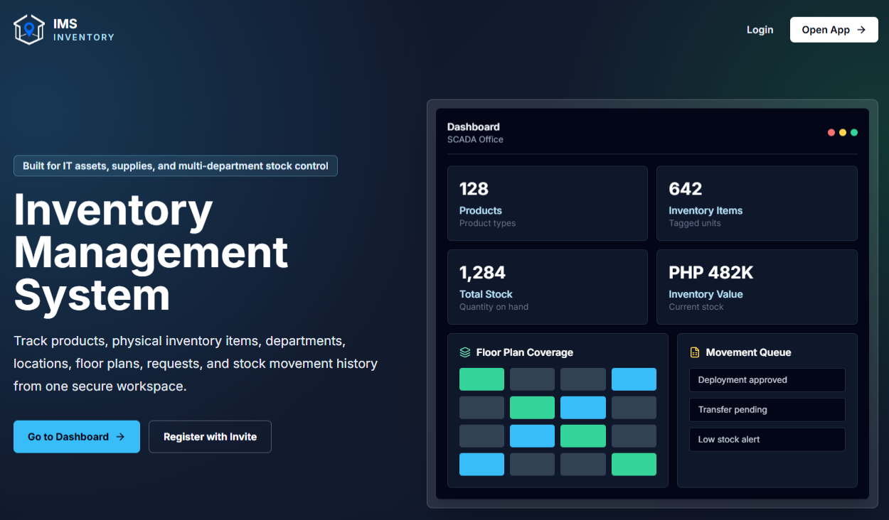

# Inventory Management System (IMS)

An open-source inventory management system for tracking products, physical assets, stock movements, locations, and departments. Built for IT asset tracking, office equipment inventory, and multi-department stock management in companies and government offices.

## Features

- **Landing Page** - public IMS overview with login, open app, dashboard, and invite registration actions
- **Products** — catalog with categories, units, suppliers, and stock level tracking
- **Inventory Items** — individual physical asset tracking with serial numbers, asset tags, barcodes, condition, and warranty
- **Stock Movements** — full movement lifecycle (stock in/out, transfer, deployment, repair, disposal, borrowed, lost, found, adjustment) with admin confirmation workflow
- **Locations & Floor Plans** — visual department mapping with location assignment
- **Bulk Add Products** — spreadsheet-style batch product creation
- **Import / Export** — CSV import and export with approval workflow
- **User Management** — roles (superadmin, admin, staff), invite codes, department assignment
- **Requests** — import, delete, edit, and password reset requests with approval workflow
- **Notifications** — live alerts for low stock, warranty expiry, unverified items, data quality issues with per-user snooze
- **Inventory Verification** — bulk and per-item verification with last-checked tracking
- **Dashboard** — summary stats, priority actions, analytics, recent activity feeds, onboarding guide
- **Dark mode** and role-based access control throughout

## Tech Stack

- **Frontend** — React 18, TypeScript, Vite, Tailwind CSS
- **Backend** — Node.js, Express, Prisma ORM
- **Database** — PostgreSQL
- **Auth** — JWT

## Requirements

- Git
- Node.js 18+
- npm
- PostgreSQL

## Quick Start

```bash
git clone https://github.com/riigait/ims.git
cd ims
```

### Backend

```bash
cd backend
npm install
cp .env.example .env
# Edit .env with your database credentials and JWT secret
npx prisma migrate dev
npm run dev
```

Backend runs on `http://localhost:3001`

### Frontend

```bash
cd frontend
npm install
npm run dev
```

Frontend runs on `http://localhost:5173`

### Docker — pre-built images (recommended, fastest)

Uses pre-built images from GitHub Container Registry. No cloning or building required.

```bash
curl -O https://raw.githubusercontent.com/riigait/ims/main/docker-compose.prod.yml
curl -O https://raw.githubusercontent.com/riigait/ims/main/.env.example
cp .env.example .env
# Edit .env — set POSTGRES_PASSWORD and JWT_SECRET
docker-compose -f docker-compose.prod.yml up -d
```

### Docker — build from source

Clones the repo and builds images locally. Use this for development or if you want to modify the code.

```bash
cp .env.example .env
# Edit .env — set POSTGRES_PASSWORD and JWT_SECRET
docker-compose up -d
```

The app will be available at `http://localhost` (or the port set in `APP_PORT`).

On first run, database migrations run automatically. Open the app, complete the initial setup, and log in.

## Environment Variables

Copy `backend/.env.example` to `backend/.env` and fill in:

| Variable | Description |
| --- | --- |
| `DATABASE_URL` | PostgreSQL connection string |
| `JWT_SECRET` | Random secret for JWT signing — change before deploying |
| `PORT` | Backend port (default: 3001) |
| `NODE_ENV` | `development` or `production` |

Never commit `.env` files. Keep database passwords and JWT secrets private.

## First Run

1. Start the backend and frontend
2. Open `http://localhost:5173`
3. Use the landing page to open the app, log in, or register with an invite
4. Complete the initial setup to create the first superadmin account
5. Log in and follow the Getting Started checklist on the dashboard

## Landing Page

The app includes a public landing page at `/` for introducing IMS before login.



It highlights:

- IT asset, supplies, and multi-department stock control
- Product, inventory item, department, location, floor plan, request, and stock movement tracking
- Dashboard preview cards for products, inventory items, total stock, and inventory value
- Quick actions for login, opening the app, going to the dashboard, and registering with an invite

## Project Structure

```text
ims/
├── backend/          # Express + Prisma API
├── frontend/         # React + Vite app
├── csv-corrector/    # CSV utility scripts
├── .github/          # CI workflows and issue templates
└── docker-compose.yml
```

## Repository Policy

- **main** - stable client-facing release branch
- **develop** - client-facing development branch
- **staging** - internal validation branch
- **Packages** - published Docker images should be public when they are intended for client use

GitHub does not support making only one branch private inside a public repository. If `staging` must be private, keep it in a private repository or private fork instead of the public repo.

## Version Tags

- First finalized develop release: `v1.0.develop`
- Future develop contributions should increment the tag: `v1.1.develop`, `v1.2.develop`, and so on
- Use tags to mark reviewed app changes, bug fixes, and issue-fix milestones

## Contributors

- Maintainer: RiiGait
- Contributors should open an issue or pull request before changing production-facing behavior
- Bug reports and issue fixes are important; include clear reproduction steps, expected behavior, actual behavior, and screenshots when useful

## Contributing

Contributions are welcome. Please open an issue first to discuss what you'd like to change.

1. Fork the repository
2. Create a feature branch (`git checkout -b feature/your-feature`)
3. Commit your changes
4. Open a pull request

## License

MIT — free to use, modify, and distribute. See [LICENSE](LICENSE) for details.
